# UrbanPulse AI - Phase 4: System Architecture

## 1. High-Level Architecture

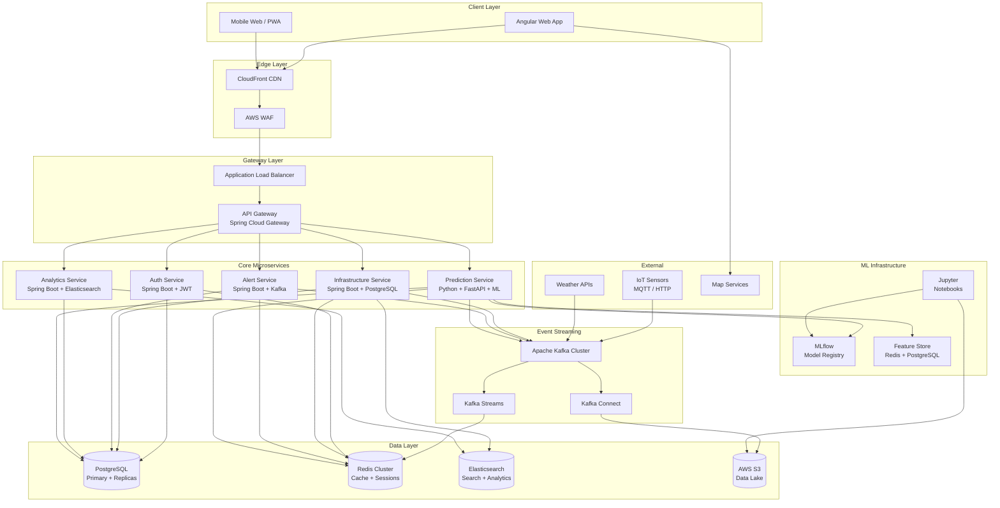

---

## 2. Low-Level Architecture

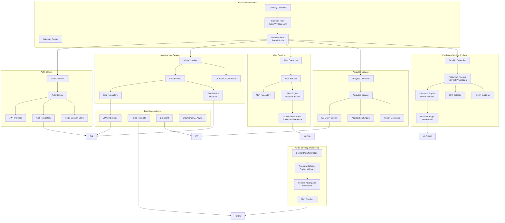

---

## 3. Component Diagram

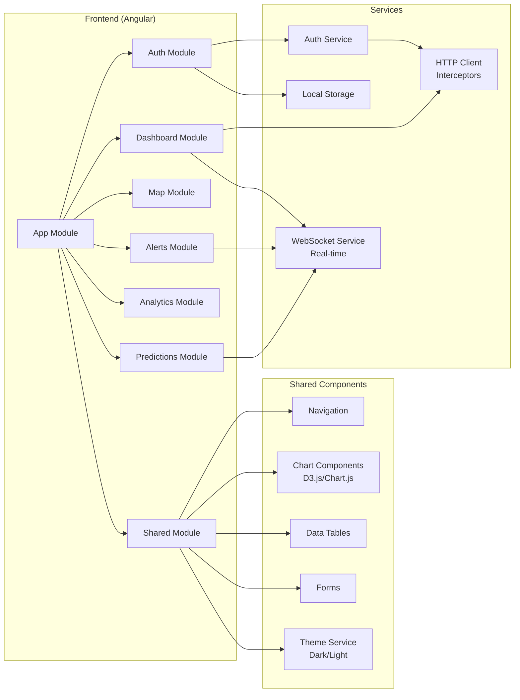

---

## 4. Sequence Diagrams

### 4.1: Sensor Data Ingestion Flow

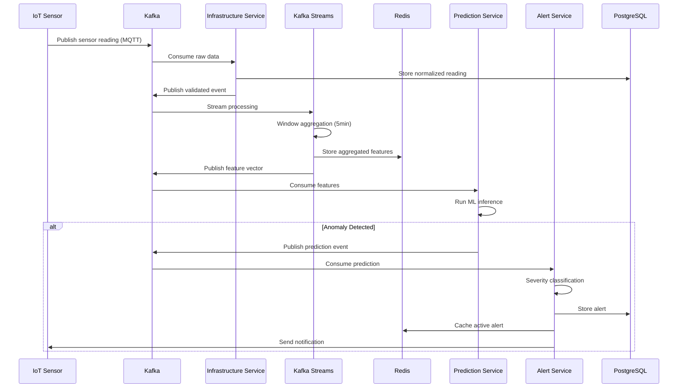

### 4.2: User Authentication Flow

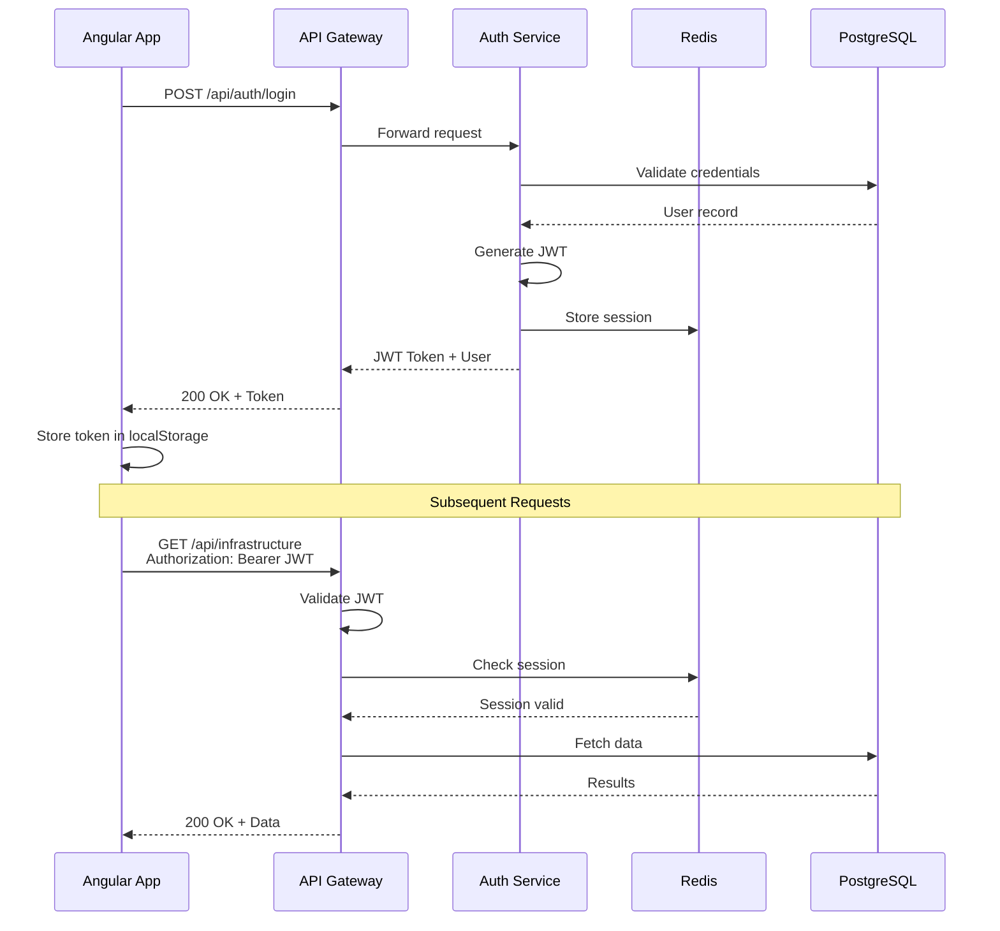

### 4.3: Prediction Request Flow

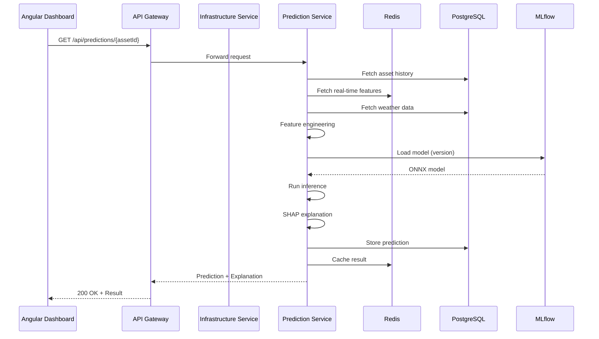

### 4.4: Real-Time Alert Flow

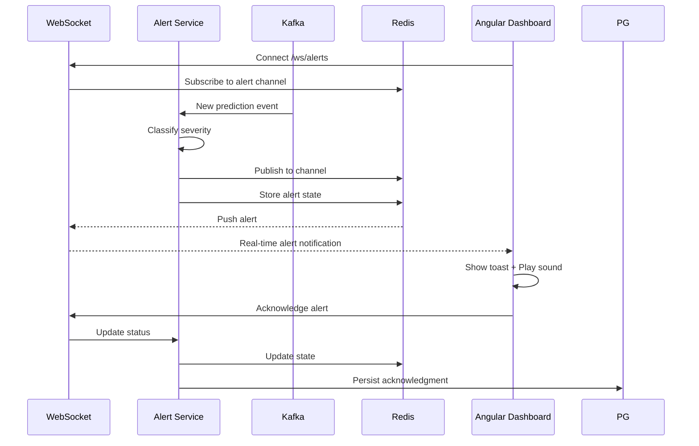

---

## 5. Deployment Diagram

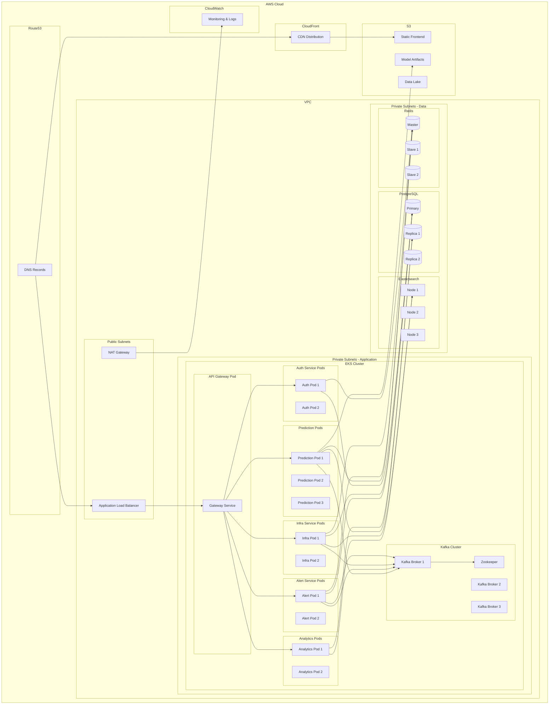

---

## 6. Database Diagram

### 6.1: PostgreSQL Schema

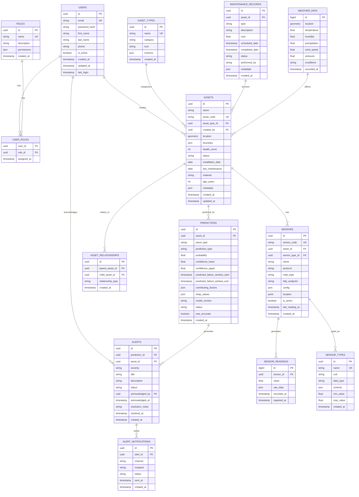

### 6.2: Redis Key Structure

```mermaid
erDiagram
    SESSIONS {
        string key "session:{jwt_id}"
        hash value "user_id, role, expires"
        int TTL 3600
    }

    SENSOR_LATEST {
        string key "sensor:latest:{sensor_id}"
        hash value "value, timestamp, status"
        int TTL 86400
    }

    ASSET_HEALTH {
        string key "asset:health:{asset_id}"
        hash value "score, last_updated, factors"
        int TTL 3600
    }

    PREDICTION_CACHE {
        string key "prediction:{asset_id}:{window}"
        string value "json_prediction"
        int TTL 1800
    }

    ACTIVE_ALERTS {
        string key "alerts:active"
        sortedset value "alert_id -> score"
        int TTL 0
    }

    FEATURE_VECTOR {
        string key "features:{asset_id}:{window}"
        hash value "aggregated_features"
        int TTL 7200
    }

    RATE_LIMIT {
        string key "ratelimit:{client_id}"
        counter value "requests_count"
        int TTL 60
    }
```

---

## 7. Kafka Event Flow Diagram

### 7.1: Topic Architecture

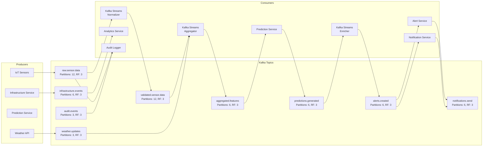

### 7.2: Event Schema Examples

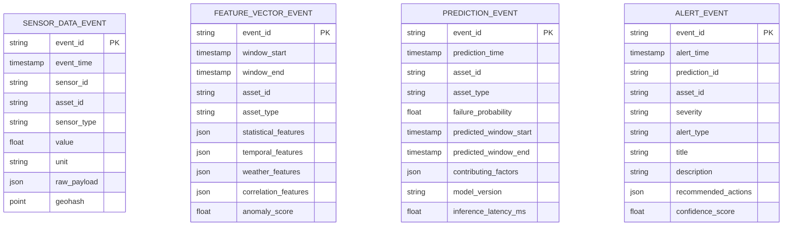

---

## 8. API Gateway Routes

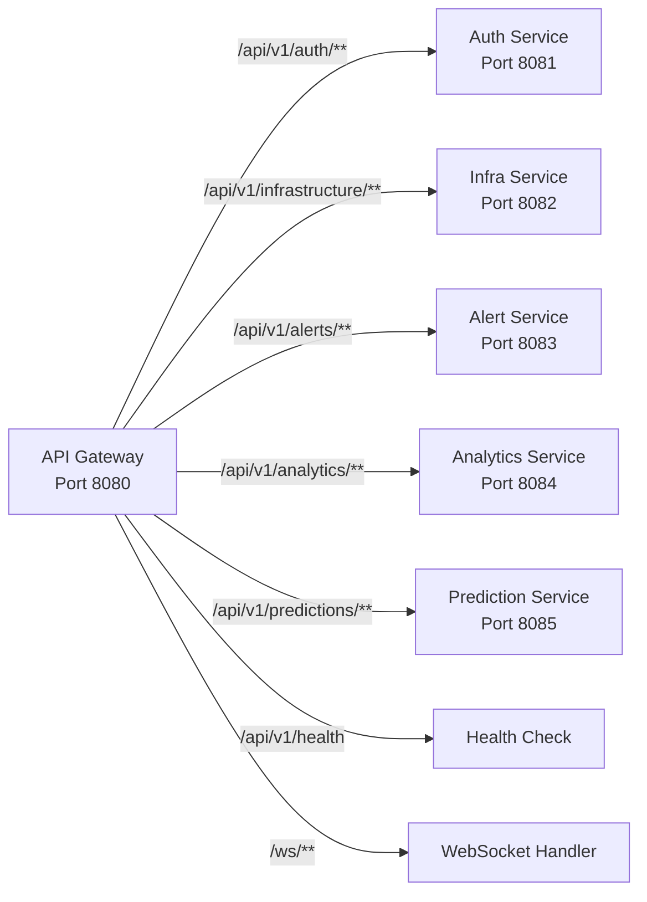

---

## 9. Technology Stack Summary

| Layer | Technology | Version | Purpose |
|-------|-----------|---------|---------|
| Frontend | Angular | 17+ | SPA Web Application |
| Frontend | TypeScript | 5.2+ | Type Safety |
| Frontend | Tailwind CSS | 3.4+ | Styling |
| Frontend | RxJS | 7.8+ | Reactive Programming |
| Frontend | Leaflet | 1.9+ | Interactive Maps |
| API Gateway | Spring Cloud Gateway | 4.x | Routing, Filters |
| Auth Service | Spring Boot | 3.2+ | Authentication |
| Infra Service | Spring Boot | 3.2+ | Asset Management |
| Alert Service | Spring Boot | 3.2+ | Alert Processing |
| Analytics | Spring Boot | 3.2+ | Reporting |
| Prediction | FastAPI | 0.104+ | ML Inference |
| Prediction | ONNX Runtime | 1.16+ | Model Serving |
| Prediction | scikit-learn | 1.3+ | ML Pipeline |
| Messaging | Apache Kafka | 3.6+ | Event Streaming |
| Database | PostgreSQL | 16+ | Primary Data Store |
| Database | PostGIS | 3.4+ | Geospatial |
| Cache | Redis | 7.2+ | Caching, Sessions |
| Search | Elasticsearch | 8.11+ | Search, Analytics |
| ML Ops | MLflow | 2.9+ | Model Registry |
| Container | Docker | 24+ | Containerization |
| Orchestration | Kubernetes | 1.28+ | Container Orchestration |
| CI/CD | GitHub Actions | - | Build, Test, Deploy |
| Cloud | AWS | - | Infrastructure |
| Monitoring | Prometheus + Grafana | - | Observability |
| Tracing | OpenTelemetry | - | Distributed Tracing |

---

## 10. Architectural Decisions (ADRs)

### ADR-001: Microservices over Monolith
**Decision**: Use microservices architecture
**Rationale**: Independent scaling of prediction service (GPU-heavy) vs. other services; team autonomy; technology diversity (Java + Python)
**Trade-offs**: Operational complexity mitigated by Kubernetes and Istio

### ADR-002: Event-Driven Architecture with Kafka
**Decision**: Use Kafka for all inter-service communication
**Rationale**: Decouples producers from consumers; enables replay; handles backpressure; supports stream processing
**Trade-offs**: Additional infrastructure; eventual consistency acceptable for use case

### ADR-003: Separate Prediction Service in Python
**Decision**: Build ML inference service in Python/FastAPI, separate from Java services
**Rationale**: Python ecosystem for ML (scikit-learn, ONNX); different scaling characteristics; independent deployment cycle
**Trade-offs**: Polyglot complexity; separate CI/CD pipeline

### ADR-004: API Gateway Pattern
**Decision**: Use Spring Cloud Gateway as single entry point
**Rationale**: Centralized cross-cutting concerns (auth, rate limiting, CORS); client simplicity; load balancing
**Trade-offs**: Single point of failure (mitigated by clustering)

### ADR-005: PostgreSQL + PostGIS for Geospatial
**Decision**: Use PostgreSQL with PostGIS extension over specialized geospatial DB
**Rationale**: ACID compliance; familiar technology; PostGIS handles geospatial queries; single database for relational + spatial
**Trade-offs**: Horizontal scaling limits (mitigated by read replicas)

### ADR-006: Redis for Caching and Sessions
**Decision**: Use Redis for multiple purposes (cache, sessions, real-time features)
**Rationale**: Sub-millisecond latency; supports data structures needed; cluster mode for high availability
**Trade-offs**: Memory cost; cache invalidation complexity

### ADR-007: ONNX Runtime for Model Serving
**Decision**: Convert models to ONNX format and use ONNX Runtime
**Rationale**: Framework-agnostic; optimized inference; language interoperability (Python training, any language inference)
**Trade-offs**: Some advanced features may not convert

### ADR-008: Angular over React
**Decision**: Use Angular for frontend
**Rationale**: Enterprise-grade framework; TypeScript-first; dependency injection; strong tooling; suits complex dashboard applications
**Trade-offs**: Steeper learning curve; more opinionated
