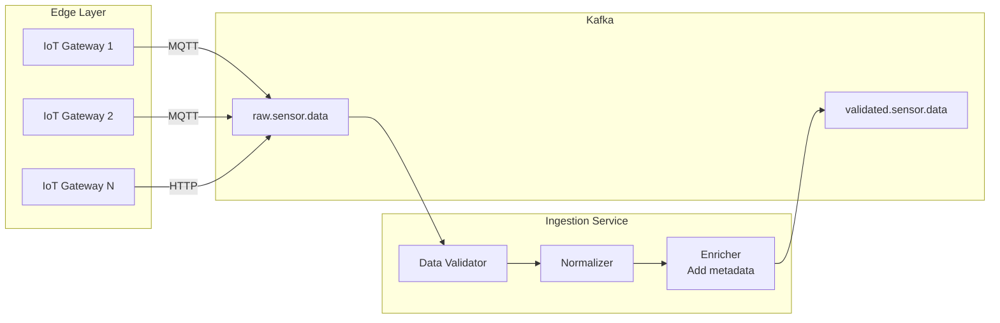
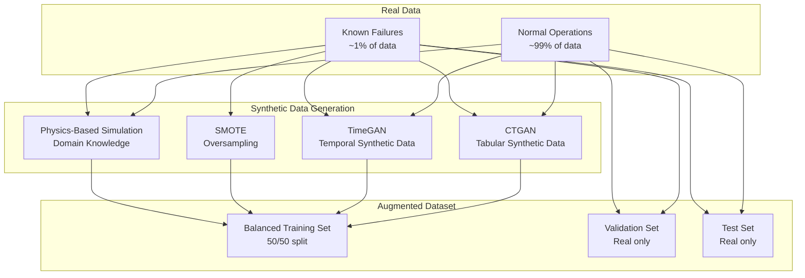
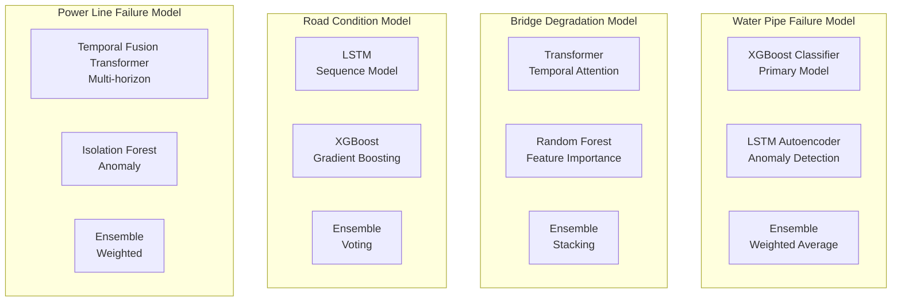
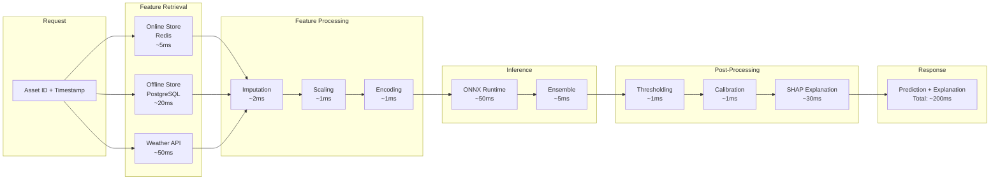
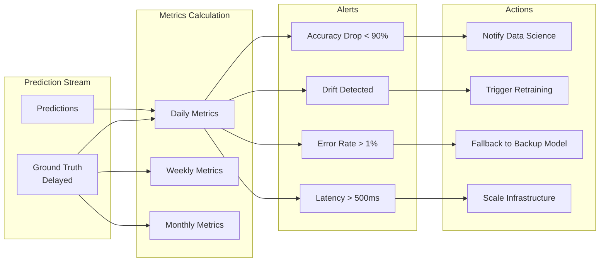
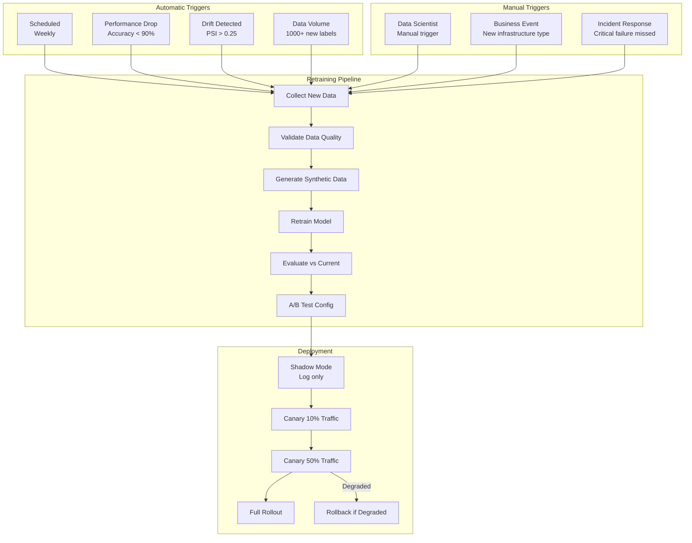
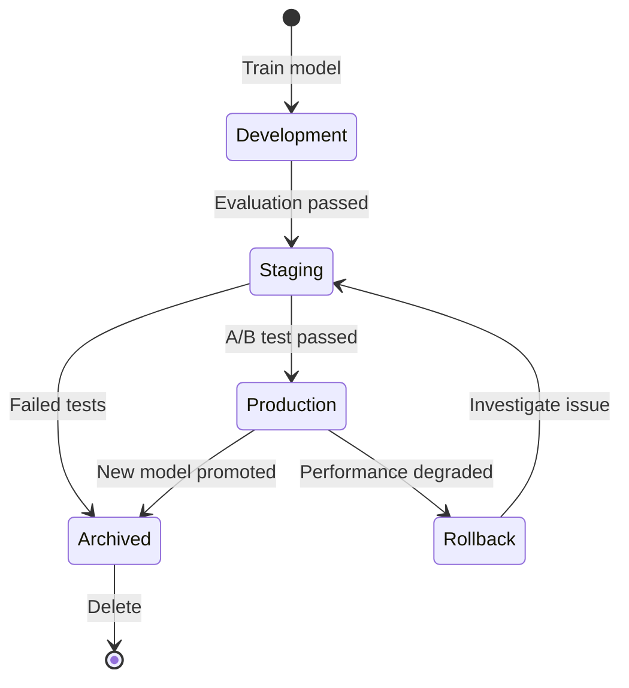

# UrbanPulse AI - Phase 5: AI/ML Architecture

## 1. AI Pipeline Overview

```mermaid
graph LR
    subgraph "Data Sources"
        S1[IoT Sensors]
        S2[Weather APIs]
        S3[Maintenance Records]
        S4[Historical Failures]
        S5[Traffic Data]
    end

    subgraph "Data Collection"
        DC1[Stream Ingestion<br/>Kafka]
        DC2[Batch Ingestion<br/>S3/PostgreSQL]
        DC3[API Polling<br/>Schedulers]
    end

    subgraph "Feature Engineering"
        FE1[Statistical Features<br/>Mean/Std/Min/Max]
        FE2[Temporal Features<br/>Trend/Seasonality/Lag]
        FE3[Geospatial Features<br/>Proximity/Density]
        FE4[Weather Features<br/>Temp/Rain/Wind]
        FE5[Correlation Features<br/>Cross-sensor]
    end

    subgraph "Feature Store"
        FS1[Online Store<br/>Redis - Real-time]
        FS2[Offline Store<br/>PostgreSQL - Historical]
    end

    subgraph "Model Training"
        MT1[Synthetic Data Generation<br/>GAN/CTGAN]
        MT2[Data Preprocessing<br/>Scaling/Encoding]
        MT3[Model Selection<br/>XGBoost/LSTM/Transformer]
        MT4[Hyperparameter Tuning<br/>Optuna]
        MT5[Model Validation<br/>TimeSeries Split]
    end

    subgraph "Model Registry"
        MR1[MLflow<br/>Experiments]
        MR2[MLflow<br/>Model Registry]
        MR3[MLflow<br/>Artifacts]
    end

    subgraph "Inference Pipeline"
        IP1[Feature Retrieval<br/>Online Store]
        IP2[Preprocessing<br/>Feature Transformer]
        IP3[Model Inference<br/>ONNX Runtime]
        IP4[Postprocessing<br/>Threshold/Calibration]
        IP5[Explanation<br/>SHAP Values]
    end

    subgraph "Monitoring"
        M1[Performance Metrics<br/>Accuracy/PR-AUC]
        M2[Drift Detection<br/>KS Test/PSI]
        M3[Data Quality<br/>Nulls/Outliers]
        M4[Business Metrics<br/>Cost Avoidance]
    end

    subgraph "Retraining"
        R1[Trigger Detection<br/>Drift/Schedule]
        R2[Data Collection<br/>New Labeled Data]
        R3[Auto-Retraining<br/>Pipeline]
        R4[A/B Testing<br/>Champion/Challenger]
        R5[Deployment<br/>Blue/Green]
    end

    S1 --> DC1
    S2 --> DC3
    S3 --> DC2
    S4 --> DC2
    S5 --> DC3

    DC1 --> FE1
    DC1 --> FE2
    DC2 --> FE3
    DC3 --> FE4

    FE1 --> FS1
    FE2 --> FS2
    FE3 --> FS1
    FE4 --> FS2
    FE5 --> FS1

    FS2 --> MT1
    MT1 --> MT2
    MT2 --> MT3
    MT3 --> MT4
    MT4 --> MT5
    MT5 --> MR1
    MR1 --> MR2
    MR2 --> MR3

    FS1 --> IP1
    IP1 --> IP2
    IP2 --> IP3
    MR2 --> IP3
    IP3 --> IP4
    IP4 --> IP5

    IP3 --> M1
    IP2 --> M2
    IP1 --> M3
    IP4 --> M4

    M1 --> R1
    M2 --> R1
    R1 --> R2
    R2 --> R3
    R3 --> R4
    R4 --> R5
```



---

## 2. Data Collection Strategy

### 2.1: Sensor Data Collection

| Sensor Type | Frequency | Data Points | Source |
|-------------|-----------|-------------|--------|
| Vibration | 100 Hz | Acceleration X/Y/Z | IoT accelerometers |
| Pressure | 1 Hz | PSI/kPa | Pressure transducers |
| Temperature | 0.1 Hz (every 10s) | Celsius/Fahrenheit | Thermocouples |
| Strain | 10 Hz | Microstrain | Strain gauges |
| Acoustic | 16 kHz | Audio spectrum | MEMS microphones |
| Humidity | 0.1 Hz | Relative % | Hygrometers |
| Flow Rate | 1 Hz | GPM/LPS | Flow meters |
| Displacement | 1 Hz | mm/inches | LVDT sensors |

### 2.2: External Data Sources

| Data Source | API | Frequency | Purpose |
|-------------|-----|-----------|---------|
| Weather | OpenWeatherMap / NOAA | Hourly | Correlation with failures |
| Traffic | Google Maps / Waze | 5 minutes | Load stress on roads/bridges |
| Earthquakes | USGS | Real-time | Seismic impact assessment |
| Satellite | Sentinel-2 / Landsat | Daily | Surface deformation |
| Census | US Census Bureau | Annual | Usage intensity |

### 2.3: Data Ingestion Pipeline



---

## 3. Synthetic Data Generation

### 3.1: Problem
Infrastructure failures are rare events (positive class ~0.1-1%). Real failure data is insufficient for training robust ML models.

### 3.2: Solution Architecture



### 3.3: CTGAN Configuration

```python
from ctgan import CTGAN

# Train CTGAN on real failure data
ctgan = CTGAN(
    epochs=300,
    batch_size=500,
    generator_dim=(256, 256),
    discriminator_dim=(256, 256),
    verbose=True
)

# Fit on real failure records
ctgan.fit(real_failure_data, discrete_columns=['asset_type', 'material', 'weather_condition'])

# Generate synthetic failure samples
synthetic_failures = ctgan.sample(10000)
```

### 3.4: Physics-Based Simulation

For each infrastructure type, domain-knowledge constraints:

**Water Pipes:**
- Barlow's equation for burst pressure
- Corrosion rate models
- Freeze-thaw cycle stress
- Water hammer pressure spikes

**Bridges:**
- Fatigue crack growth (Paris' law)
- Load distribution models
- Corrosion-induced section loss
- Natural frequency degradation

**Roads:**
- Pavement condition index (PCI) deterioration curves
- Traffic load equivalency factors
- Temperature stress calculations
- Subgrade moisture effects

**Power Lines:**
- Sag-tension calculations
- Thermal rating models
- Insulator degradation curves
- Vegetation growth interference

---

## 4. Feature Engineering

### 4.1: Feature Categories

#### Statistical Features (Window: 1h, 6h, 24h, 7d)
```python
statistical_features = {
    'mean': np.mean(window),
    'std': np.std(window),
    'min': np.min(window),
    'max': np.max(window),
    'range': max - min,
    'skewness': scipy.stats.skew(window),
    'kurtosis': scipy.stats.kurtosis(window),
    'rms': np.sqrt(np.mean(window**2)),
    'peak_to_peak': np.ptp(window),
    'percentile_25': np.percentile(window, 25),
    'percentile_50': np.percentile(window, 50),
    'percentile_75': np.percentile(window, 75),
    'iqr': percentile_75 - percentile_25,
}
```

#### Temporal Features
```python
temporal_features = {
    'hour_of_day': dt.hour,
    'day_of_week': dt.dayofweek,
    'month': dt.month,
    'is_weekend': dt.dayofweek >= 5,
    'is_holiday': holiday_calendar.is_holiday(dt),
    'days_since_maintenance': (dt - last_maintenance).days,
    'days_since_installation': (dt - installation_date).days,
    'season': get_season(dt.month),
    'trend_7d': linear_trend(window_7d),
    'trend_30d': linear_trend(window_30d),
}
```

#### Geospatial Features
```python
geospatial_features = {
    'nearest_water_body_distance': haversine_distance(asset_loc, water_bodies),
    'nearest_fault_line_distance': haversine_distance(asset_loc, fault_lines),
    'population_density_1km': population_density_within_radius(asset_loc, 1000),
    'elevation': srtm_elevation(asset_loc),
    'slope': terrain_slope(asset_loc),
    'soil_type': classify_soil(asset_loc),
    'num_nearby_assets': count_assets_within_radius(asset_loc, 500),
    'avg_health_nearby': mean_health_score_within_radius(asset_loc, 1000),
}
```

#### Weather Features
```python
weather_features = {
    'temperature': current_temp,
    'temperature_change_24h': temp_now - temp_24h_ago,
    'temperature_deviation_from_normal': temp_now - historical_avg,
    'humidity': current_humidity,
    'precipitation_24h': total_rain_24h,
    'precipitation_7d': total_rain_7d,
    'wind_speed': current_wind,
    'wind_gust': max_wind_gust,
    'pressure': barometric_pressure,
    'pressure_trend': pressure_6h_trend,
    'freeze_thaw_cycles_7d': count_freeze_thaw(window_7d),
    'extreme_weather_flag': is_extreme_weather(),
}
```

#### Cross-Sensor Correlation Features
```python
correlation_features = {
    'vibration_temp_correlation': corr(vibration_window, temp_window),
    'pressure_flow_correlation': corr(pressure_window, flow_window),
    'multi_sensor_anomaly_score': isolation_forest_score(all_sensors),
    'spatial_correlation_nearby': mean_failure_probability_nearby,
}
```

### 4.2: Feature Store Schema

```sql
-- Online Feature Store (Redis)
Key: "features:{asset_id}:{window}"
Value: {
    "statistical": {json},
    "temporal": {json},
    "weather": {json},
    "geospatial": {json},
    "correlation": {json},
    "computed_at": timestamp,
    "ttl": 7200
}

-- Offline Feature Store (PostgreSQL)
CREATE TABLE feature_vectors (
    id BIGSERIAL PRIMARY KEY,
    asset_id UUID REFERENCES assets(id),
    window_start TIMESTAMP NOT NULL,
    window_end TIMESTAMP NOT NULL,
    feature_version VARCHAR(20),
    statistical_features JSONB,
    temporal_features JSONB,
    weather_features JSONB,
    geospatial_features JSONB,
    correlation_features JSONB,
    label BOOLEAN, -- did failure occur within 72h?
    created_at TIMESTAMP DEFAULT NOW()
);
```

---

## 5. Model Selection

### 5.1: Model Architecture per Infrastructure Type



### 5.2: Model Comparison

| Model | Type | Strengths | Use Case | Target Metric |
|-------|------|-----------|----------|---------------|
| XGBoost | Gradient Boosting | Feature importance, fast inference | Water pipes, Roads | PR-AUC |
| LSTM | Deep Learning | Temporal patterns, sequences | Roads, Bridges | PR-AUC |
| Transformer | Deep Learning | Long-range dependencies, attention | Bridges, Power | PR-AUC |
| Temporal Fusion Transformer | Deep Learning | Multi-horizon, variable attention | Power lines | PR-AUC |
| Isolation Forest | Anomaly Detection | Unsupervised, fast | All types | Contamination |

### 5.3: Ensemble Strategy

```python
class InfrastructureFailureEnsemble:
    def __init__(self, models, weights):
        self.models = models  # [xgboost, lstm, transformer]
        self.weights = weights  # [0.5, 0.3, 0.2]

    def predict(self, features):
        predictions = [model.predict_proba(features) for model in self.models]
        ensemble_prob = np.average(predictions, weights=self.weights)
        return ensemble_prob

    def explain(self, features):
        # SHAP for XGBoost, Attention weights for LSTM/Transformer
        shap_values = self.models[0].explain(features)
        attention_weights = self.models[1].get_attention(features)
        return {
            'shap': shap_values,
            'attention': attention_weights,
            'feature_importance': self._combine_explanations(shap_values, attention_weights)
        }
```

---

## 6. Training Pipeline

### 6.1: Training Orchestration

```mermaid
graph LR
    subgraph "Data Preparation"
        D1[Load Historical Data]
        D2[Generate Synthetic Data]
        D3[Feature Engineering]
        D4[Train/Test Split<br/>Time-based]
    end

    subgraph "Training"
        T1[Hyperparameter Search<br/>Optuna]
        T2[Cross-Validation<br/>TimeSeriesSplit]
        T3[Model Training]
        T4[Model Evaluation]
    end

    subgraph "Registration"
        R1[Log to MLflow]
        R2[Register Model]
        R3[Stage: Staging]
        R4[Run Integration Tests]
        R5[Promote to Production]
    end

    D1 --> D2
    D2 --> D3
    D3 --> D4
    D4 --> T1
    T1 --> T2
    T2 --> T3
    T3 --> T4
    T4 --> R1
    R1 --> R2
    R2 --> R3
    R3 --> R4
    R4 --> R5
```



### 6.2: Hyperparameter Configuration

```python
# Optuna search space
import optuna

def objective(trial, model_type='xgboost'):
    if model_type == 'xgboost':
        params = {
            'n_estimators': trial.suggest_int('n_estimators', 100, 1000),
            'max_depth': trial.suggest_int('max_depth', 3, 12),
            'learning_rate': trial.suggest_float('learning_rate', 0.01, 0.3, log=True),
            'subsample': trial.suggest_float('subsample', 0.6, 1.0),
            'colsample_bytree': trial.suggest_float('colsample_bytree', 0.6, 1.0),
            'min_child_weight': trial.suggest_int('min_child_weight', 1, 10),
            'scale_pos_weight': trial.suggest_float('scale_pos_weight', 1, 50),
            'reg_alpha': trial.suggest_float('reg_alpha', 1e-8, 10.0, log=True),
            'reg_lambda': trial.suggest_float('reg_lambda', 1e-8, 10.0, log=True),
        }
    elif model_type == 'lstm':
        params = {
            'hidden_size': trial.suggest_int('hidden_size', 64, 512),
            'num_layers': trial.suggest_int('num_layers', 1, 4),
            'dropout': trial.suggest_float('dropout', 0.1, 0.5),
            'learning_rate': trial.suggest_float('lr', 1e-4, 1e-2, log=True),
            'batch_size': trial.suggest_categorical('batch_size', [32, 64, 128, 256]),
            'sequence_length': trial.suggest_int('seq_len', 24, 168),
        }

    model = create_model(model_type, params)
    score = cross_validate(model, X_train, y_train, cv=TimeSeriesSplit(5))
    return score
```

### 6.3: Training Schedule

| Trigger | Frequency | Description |
|---------|-----------|-------------|
| Scheduled | Weekly | Full retraining with all data |
| Drift Detection | On-demand | When data drift detected |
| New Data | On-demand | When >1000 new labeled samples |
| Manual | On-demand | Data scientist triggered |

---

## 7. Inference Pipeline

### 7.1: Real-Time Inference Flow



### 7.2: ONNX Conversion

```python
import skl2onnx
from skl2onnx import convert_sklearn
from skl2onnx.common.data_types import FloatTensorType

# Convert XGBoost to ONNX
initial_type = [('float_input', FloatTensorType([None, n_features]))]
onnx_model = convert_sklearn(
    xgboost_model,
    initial_types=initial_type,
    target_opset=15,
    options={'zipmap': False}
)

# Save
with open("water_pipe_model.onnx", "wb") as f:
    f.write(onnx_model.SerializeToString())

# Load with ONNX Runtime
import onnxruntime as ort
session = ort.InferenceSession("water_pipe_model.onnx")
```

### 7.3: Batch Inference

```python
# Kafka Streams batch processing
class BatchInferenceProcessor:
    def __init__(self, model_session, feature_store):
        self.session = model_session
        self.feature_store = feature_store
        self.window_size = timedelta(minutes=5)

    def process_window(self, asset_ids):
        # Fetch features for all assets in batch
        features = self.feature_store.get_batch(asset_ids)

        # Run batch inference
        input_name = self.session.get_inputs()[0].name
        outputs = self.session.run(None, {input_name: features.values.astype(np.float32)})

        # Create prediction events
        predictions = []
        for i, asset_id in enumerate(asset_ids):
            predictions.append({
                'asset_id': asset_id,
                'probability': outputs[0][i][1],
                'timestamp': datetime.utcnow(),
                'model_version': self.model_version,
                'inference_latency_ms': inference_time
            })

        return predictions
```

---

## 8. Model Monitoring

### 8.1: Performance Metrics Dashboard

```python
# Metrics tracked
model_metrics = {
    # Classification Metrics
    'accuracy': accuracy_score(y_true, y_pred),
    'precision': precision_score(y_true, y_pred),
    'recall': recall_score(y_true, y_pred),
    'f1_score': f1_score(y_true, y_pred),
    'pr_auc': average_precision_score(y_true, y_proba),
    'roc_auc': roc_auc_score(y_true, y_proba),

    # Ranking Metrics
    'precision_at_k': precision_at_k(y_true, y_proba, k=10),
    'recall_at_k': recall_at_k(y_true, y_proba, k=10),

    # Calibration Metrics
    'expected_calibration_error': ece(y_true, y_proba),
    'brier_score': brier_score_loss(y_true, y_proba),

    # Business Metrics
    'cost_avoidance': calculate_cost_avoidance(y_true, y_pred),
    'false_positive_rate': fp / (fp + tn),
    'false_negative_rate': fn / (fn + tp),
    'mean_time_to_detection': mean_detection_time,
    'alert fatigue score': alert_fatigue_ratio,
}
```

### 8.2: Automated Monitoring Pipeline



---

## 9. Drift Detection

### 9.1: Types of Drift

| Drift Type | Detection Method | Threshold | Action |
|------------|-----------------|-----------|--------|
| **Data Drift** | Kolmogorov-Smirnov test | p-value < 0.01 | Alert data science |
| **Concept Drift** | Population Stability Index (PSI) | PSI > 0.25 | Trigger retraining |
| **Feature Drift** | Wasserstein distance | > 2 std dev | Feature engineering review |
| **Label Drift** | Class distribution change | KL div > 0.1 | Review labeling process |
| **Prediction Drift** | Output distribution shift | PSI > 0.2 | Model review |

### 9.2: Drift Detection Implementation

```python
from scipy import stats
import numpy as np

class DriftDetector:
    def __init__(self, reference_data, psi_threshold=0.25, ks_threshold=0.01):
        self.reference = reference_data
        self.psi_threshold = psi_threshold
        self.ks_threshold = ks_threshold
        self.reference_distributions = self._compute_distributions(reference_data)

    def detect_drift(self, current_data):
        drift_report = {}

        for feature in self.reference.columns:
            ref_dist = self.reference[feature]
            curr_dist = current_data[feature]

            # KS Test
            ks_stat, p_value = stats.ks_2samp(ref_dist, curr_dist)

            # PSI
            psi = self._calculate_psi(ref_dist, curr_dist)

            # Wasserstein distance
            wasserstein = stats.wasserstein_distance(ref_dist, curr_dist)

            drift_report[feature] = {
                'ks_statistic': ks_stat,
                'p_value': p_value,
                'psi': psi,
                'wasserstein': wasserstein,
                'is_drifted': p_value < self.ks_threshold or psi > self.psi_threshold
            }

        overall_drift = any(r['is_drifted'] for r in drift_report.values())
        return overall_drift, drift_report

    def _calculate_psi(self, expected, actual, buckets=10):
        def scale_range(input, min_val, max_val):
            return (input - min_val) / (max_val - min_val)

        breakpoints = np.linspace(0, 1, buckets + 1)
        breakpoints = np.percentile(expected, breakpoints * 100)

        expected_percents = np.histogram(expected, breakpoints)[0] / len(expected)
        actual_percents = np.histogram(actual, breakpoints)[0] / len(actual)

        # Avoid division by zero
        expected_percents = np.clip(expected_percents, 0.0001, 1)
        actual_percents = np.clip(actual_percents, 0.0001, 1)

        psi = np.sum((actual_percents - expected_percents) * np.log(actual_percents / expected_percents))
        return psi
```

### 9.3: Drift Detection Schedule

| Check | Frequency | Window Size |
|-------|-----------|-------------|
| Feature drift | Hourly | Last 24h vs reference |
| Prediction drift | Daily | Last 7d vs previous 7d |
| Full drift assessment | Weekly | Last 30d vs training data |
| Label drift | Weekly | Class distribution |

---

## 10. Retraining Strategy

### 10.1: Retraining Triggers



### 10.2: A/B Testing Framework

```python
class ModelABTest:
    def __init__(self, champion_model, challenger_model, traffic_split=0.1):
        self.champion = champion_model
        self.challenger = challenger_model
        self.split = traffic_split
        self.metrics = {'champion': [], 'challenger': []}

    def route_request(self, request):
        # Route 10% traffic to challenger
        if random.random() < self.split:
            model = self.challenger
            variant = 'challenger'
        else:
            model = self.champion
            variant = 'champion'

        prediction = model.predict(request)
        return prediction, variant

    def compare_models(self, window='7d'):
        champion_metrics = self.get_metrics('champion', window)
        challenger_metrics = self.get_metrics('challenger', window)

        # Statistical significance test
        p_value = stats.ttest_ind(
            champion_metrics['pr_auc'],
            challenger_metrics['pr_auc']
        ).pvalue

        if challenger_metrics['pr_auc'] > champion_metrics['pr_auc'] and p_value < 0.05:
            return 'promote_challenger'
        return 'keep_champion'
```

### 10.3: Model Registry States



---

## 11. ML Infrastructure Specifications

### 11.1: Compute Requirements

| Component | CPU | Memory | GPU | Instances |
|-----------|-----|--------|-----|-----------|
| Training | 16 cores | 64 GB | 1x V100 | 2 (spot) |
| Inference | 4 cores | 8 GB | - | 3 (on-demand) |
| Feature Store | 8 cores | 32 GB | - | 2 |
| MLflow | 4 cores | 16 GB | - | 1 |
| Jupyter | 8 cores | 32 GB | 1x T4 | 1 |

### 11.2: Storage Requirements

| Data Type | Size | Retention | Storage |
|-----------|------|-----------|---------|
| Raw sensor data | 10 TB/month | 90 days | S3 Standard |
| Feature vectors | 500 GB/month | 2 years | S3 + PostgreSQL |
| Model artifacts | 10 GB/version | All versions | S3 + MLflow |
| Training data | 2 TB | 2 years | S3 Glacier |
| Experiment logs | 50 GB/month | 1 year | MLflow backend |

### 11.3: Cost Estimation (Monthly)

| Component | Cost (USD) |
|-----------|-----------|
| EKS Cluster | $800 |
| S3 Storage | $500 |
| RDS PostgreSQL | $600 |
| ElastiCache Redis | $400 |
| MSK Kafka | $1,200 |
| OpenSearch | $500 |
| SageMaker Training | $1,500 |
| CloudWatch | $200 |
| **Total** | **~$5,700/month** |
